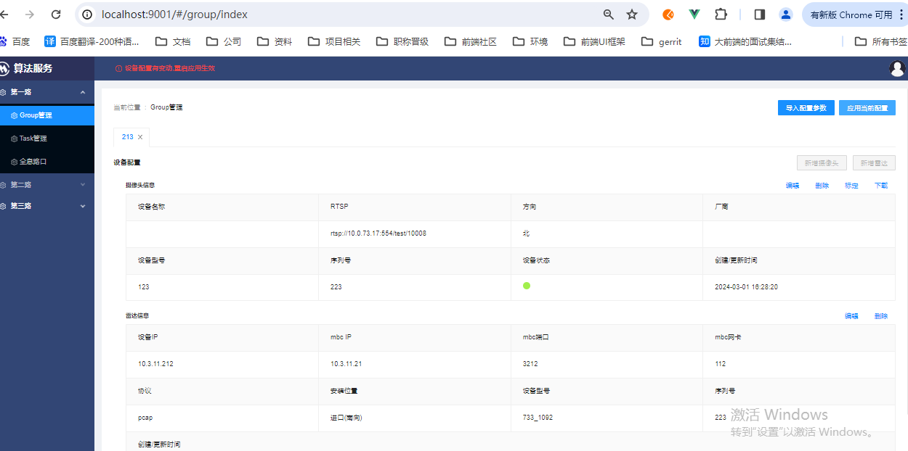
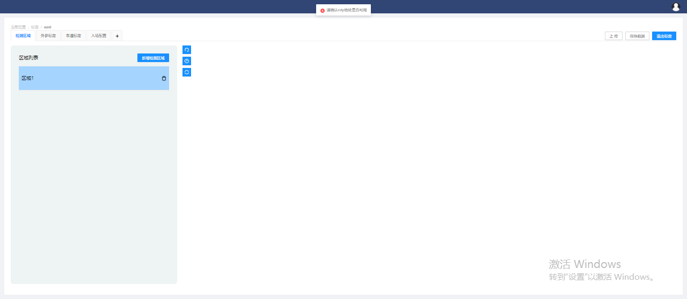

# antd-demo-v3

```
  自适应布局,全局状态管理，国际化，路由菜单权限
```

## Project setup
```
npm install
```

### Compiles and hot-reloads for development
```
npm run serve
```

### Compiles and minifies for production
```
npm run build
```

### Lints and fixes files
```
npm run lint
```

### Customize configuration
See [Configuration Reference](https://cli.vuejs.org/config/).

### Docker build
(可选) 删除镜像
docker rm -f edge-v2x-mark-ui:0.0.1

构建镜像
docker build -t edge-v2x-mark-ui:0.0.16 ./

# 保存镜像
docker save edge-v2x-mark-ui:0.0.16 > edge-v2x-mark-ui-0.0.16.tar

使用edge-v2x-mark镜像运行
docker run -d -it \
           --name="edge-v2x-mark-ui" \
           --network=host \
           --restart=always \
           edge-v2x-mark-ui:0.0.16



